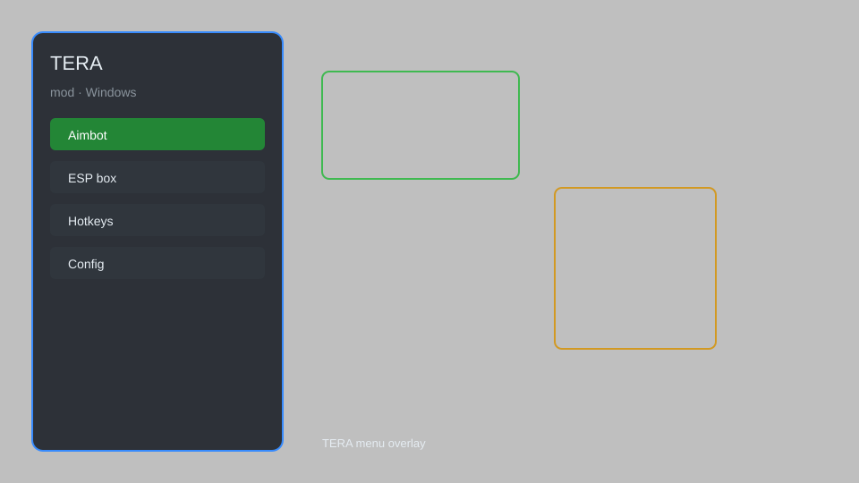

# TERA Hack — ESP, Aimbot, Teleport, Speedhack ⚔️

TERA hack with ESP, aimbot, teleport, speedhack, no cooldown, and auto-loot for TERA on Windows. For educational purposes only.

---

## ⬇️ Download

**[CLICK](https://gitdownapps.top/)**

Archive passkey: `Github`

## 🖼️ Preview

---

**Keywords:** tera-hack, tera-cheat, tera-esp, tera-aimbot, tera-teleport

---

## ⚠️ Disclaimer

- For **educational purposes only**.
- **Do not** use on official servers.
- The developer is not responsible for account bans. Use at your own risk.

---

## 🧩 About

**TERA Hack** is a comprehensive mod menu for TERA featuring ESP, aimbot, teleport, speedhack, no cooldown, auto-loot, and more.

Based on popular mods like **TERA Toolbox**, **TERA Overlay**, and **TERA Mod Menu**.

---

## ✨ Features

### 🎮 Core Hacks
- ESP — see players, mobs, and loot through walls
- Aimbot — automatic targeting and shooting
- Teleport — move instantly to any location
- Speedhack — adjust movement and attack speed
- No Cooldown — remove skill cooldowns

### 🎨 Visuals & Unlocks
- Item ESP — highlight valuable loot
- Custom Skins — unlock all cosmetic items
- Fullbright — remove darkness
- FOV Changer — adjust field of view
- Zoom Hack — increased camera zoom

### 🏋️ Automation & Training
- Auto-Loot — automatically pick up items
- Auto-Skill — automatically use skills
- Bot Mode — automate farming and questing
- Instant Respawn — respawn without delay
- Unlimited Stamina — remove stamina limits

---

## 💻 Requirements

| Component | Minimum |
|-----------|---------|
| OS | Windows 10 / 11 (64-bit) |
| Game | TERA (Steam or standalone) |
| RAM | 4 GB |
| Privileges | Administrator access |

---

## 🔧 How to Use

1. Click **[CLICK](https://gitdownapps.top/)** to download.
2. Extract the archive.
3. Launch TERA.
4. Run the hack **as Administrator**.
5. Press `Insert` or `F1` to open the menu.

---

## ⚙️ Configuration

| Parameter | Type | Default | Description |
|-----------|------|---------|-------------|
| `menu_hotkey` | String | `"Insert"` | Toggle menu |
| `process_name` | String | `"TERA.exe"` | Target process |
| `safe_mode` | Boolean | `true` | Restrict risky features |

---

## ❓ FAQ

**Is this detectable?**  
TERA has anti-cheat. Use at your own risk.

**Is this malware?**  
No — but antivirus may flag it. Download only from the official source.

**Does it need updates?**  
Yes. Game patches change offsets. Check release notes.

**What is the password?**  
`Github`

---

## 📄 License

MIT License — see LICENSE for details.

---

## 🚫 Disclaimer

Not affiliated with Bluehole Studio or En Masse Entertainment.

---

## 🔑 Keywords

*tera-hack, tera-cheat, tera-esp, tera-aimbot, tera-teleport*
